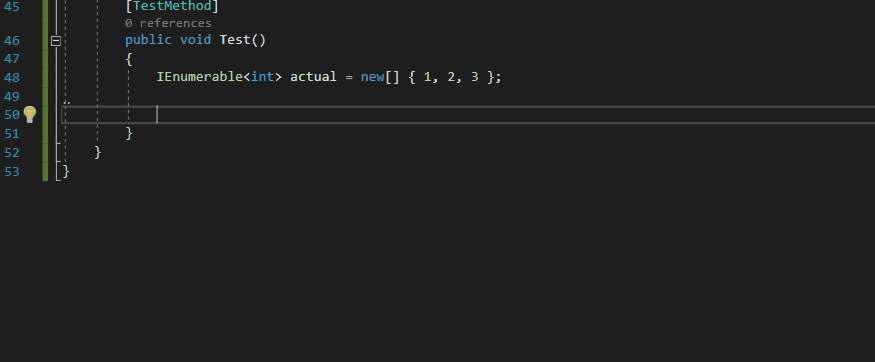

<a href="https://www.fluentassertions.com"></a>

***"With Fluent Assertions, the assertions look beautiful, natural and most importantly, extremely readable"*** -[_Girish_](https://twitter.com/girishracharya)

* Latest nuget [](https://www.nuget.org/packages/fluentassertions.analyzers/)
* The build status is [](https://github.com/fluentassertions/fluentassertions.analyzers/actions/workflows/ci.yml)

A collection of Analyzers based on the best practices [tips](https://fluentassertions.com/tips/).


## Analysis and Code Fix in Action



## Install

using the latest stable version:

```powershell
Install-Package FluentAssertions.Analyzers
```

## Getting Started

### Build

```bash
dotnet build src
```

### Tests

```bash
dotnet test src --configuration Release  --filter 'TestCategory=Completed'
```

## Example Usages
- https://github.com/SonarSource/sonar-dotnet/pull/2072
